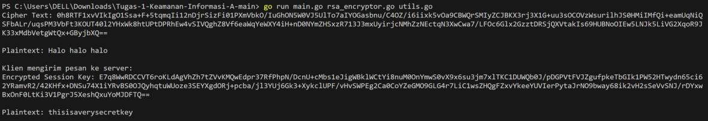
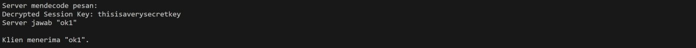
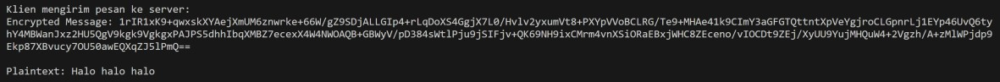
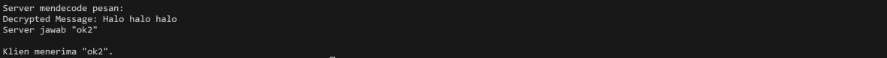

**TUGAS 1 KEAMANAN INFORMASI KELAS A**

# Implementasi Enkripsi RSA dan Keamanan

Repositori ini berisi implementasi sederhana enkripsi RSA dan contoh dasar implementasi keamanan dalam skenario komunikasi klien-server.

## Penulis

Repository ini disusun atas pemikiran bersama 7 anggota handal berkualitas (Nama - NRP) :
- **(5025201004)** Danial Farros Maulana 
- **(5025201015)** Nadya Permata Sari
- **(5025201017)** Muhammad Rolanov Wowor
- **(5025201070)** Aaliyah Farah Adibah
- **(5025201097)** Benedictus Bimo Cahyo Wicaksono
- **(5025201132)** Putu Andhika Pratama
- **(5025201202)** Aiffah kiysa waafi        


## Overview

Kode ini terorganisir sebagai berikut:

- `main.go`: Program utama yang menunjukkan enkripsi RSA dan contoh dasar implementasi keamanan dalam skenario klien-server.
- `rsa_encryptor.go`: Wrapper sederhana untuk operasi enkripsi RSA.
- `utils.go`: Fungsi utilitas untuk pemeriksaan kesalahan dan operasi berkas.

## Memulai

Untuk menjalankan program, ikuti langkah-langkah berikut:

1. Pastikan Anda telah menginstal Go di mesin Anda.
2. clone repositori:
3. Jalankan program dengan command:

    ```bash
    go run main.go rsa_encryptor.go utils.go
    ```

4. Ikuti petunjuk di termnisl layar untuk melihat implementasi enkripsi RSA dan keamanan dalam aksi.

## Fitur

### Enkripsi RSA

Struktur `RSAEncryptor` menyediakan metode untuk enkripsi dan dekripsi RSA menggunakan skema OAEP (Optimal Asymmetric Encryption Padding).

- `NewRSAEncryptor(bits int) *RSAEncryptor`: Menginisialisasi RSAEncryptor baru dengan ukuran kunci tertentu.
- `SaveKeysToFile(publicKeyFile, privateKeyFile string)`: Menyimpan kunci publik dan privat ke berkas.
- `Encrypt(secretMessage string) string`: Mengenkripsi pesan menggunakan RSA-OAEP.
- `Decrypt(cipherText string) string`: Mendekripsi pesan menggunakan RSA-OAEP.

### Implementasi Keamanan 

Program utama menunjukkan skenario komunikasi klien-server dengan implementasi keamanan:

1. Klien menghasilkan kunci sesi dan mengenkripsinya dengan kunci publik server.

    

2. Server mendekripsi kunci sesi dan memberikan respons "ok1".

    

3. Klien mengirim pesan terenkripsi ke server menggunakan kunci sesi.

    

4. Server mendekripsi pesan dan memberikan respons "ok2".

    


5. Setiap langkah dicetak di layar untuk menggambarkan alur komunikasi.

## Sign-Verify (Otentikasi)

Skenario **Sign-Verify** juga disertakan dalam program utama, di mana server memverifikasi identitas klien menggunakan otentikasi sign-verify.

- Server memiliki kunci publik klien.
- Klien menandatangani pesan dengan kunci privatnya.
- Server memverifikasi tanda tangan menggunakan kunci publik klien.

Langkah tambahan ini memastikan bahwa klien memiliki hak untuk berkomunikasi dengan server.

## Struktur Berkas

- `public.pem`: Berkas kunci publik.
- `private.pem`: Berkas kunci privat.
